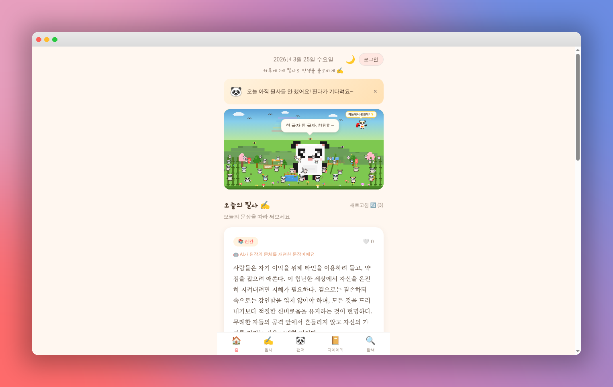
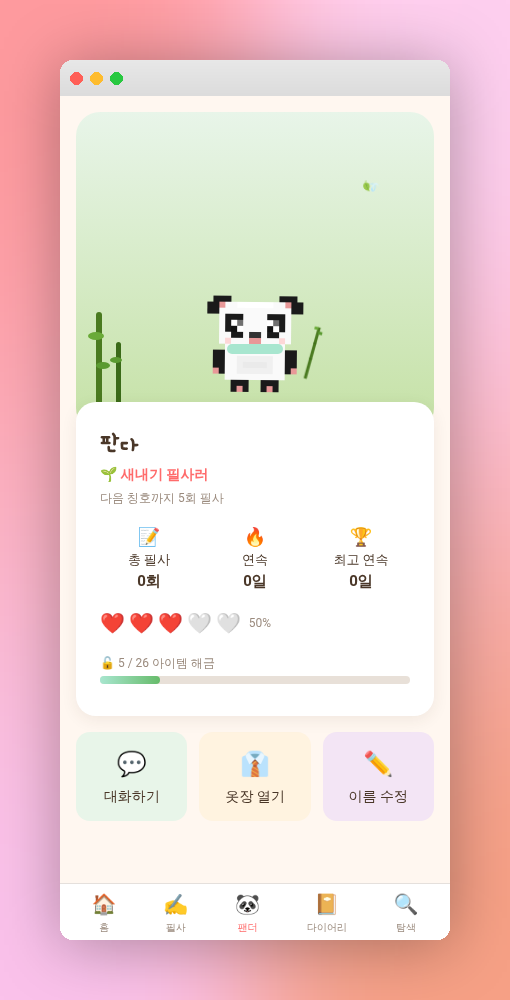

<p align="center">
  
</p>

<h1 align="center">🐼 필사아잇 (Pilsa-ait)</h1>

<p align="center">
  <b>매일 좋은 문장을 따라 쓰며 마음을 가꾸는 필사 서비스</b><br/>
  <i>A daily handwriting practice app with a virtual panda companion</i>
</p>

<p align="center">
  
  
  
  
  
</p>

<p align="center">
  <a href="https://everything-is-ok.lovable.app">🌐 Live Demo</a>
</p>

---

## 📖 소개

**필사아잇**은 매일 명문장을 따라 쓰며 독서 습관을 기르고, 귀여운 픽셀 판다와 함께 성장하는 모바일 웹 서비스입니다.

> "하루에 2개 필사로 인생을 풍요롭게 ✍️"

---

## ✨ 주요 기능

### 📝 오늘의 필사
- AI가 엄선한 명문장을 매일 새롭게 제공
- 원문을 따라 쓰며 일치율을 실시간 측정
- 필사 완료 시 감정 태그 및 메모 기록

### 🐼 나만의 판다
- 픽셀아트 판다 캐릭터를 키우는 타마고치 시스템
- 필사할수록 행복도 상승 & 새로운 아이템 해금
- 판다와 AI 채팅으로 독서 이야기 나누기

### 🔍 문장 탐색
- 카테고리별 필터 (에세이, 소설, 시/산문, 자기계발 등)
- 인기순 / 최신순 정렬
- 북마크 기능으로 좋아하는 문장 저장

### 📔 다이어리
- 나의 필사 기록을 한눈에 확인
- 연속 필사 스트릭 트래킹
- 월별 필사 통계

---

## 📱 스크린샷

<p align="center">
  
  &nbsp;&nbsp;&nbsp;
  
  &nbsp;&nbsp;&nbsp;
  
</p>

<p align="center">
  <sub>홈 화면 · 판다 프로필 · 문장 탐색</sub>
</p>

---

## 🛠 기술 스택

| 영역 | 기술 |
|------|------|
| **Frontend** | React 18, TypeScript, Vite |
| **Styling** | Tailwind CSS, Framer Motion |
| **Backend** | Supabase (Auth, Database, Edge Functions) |
| **AI** | Google Gemini (문장 생성 & 판다 채팅) |
| **State** | TanStack Query, React Context |
| **UI** | shadcn/ui, Radix UI |

---

## 🏗 아키텍처

```
┌─────────────────────────────────────────────┐
│                  Frontend                    │
│  React + TypeScript + Tailwind + Vite        │
├─────────────────────────────────────────────┤
│               Supabase Backend               │
│  ┌──────────┬──────────┬──────────────────┐  │
│  │   Auth   │ Database │  Edge Functions  │  │
│  │ (Google) │ (PostgreSQL)│ (AI Integration)│ │
│  └──────────┴──────────┴──────────────────┘  │
└─────────────────────────────────────────────┘
```

---

## 📊 주요 데이터 모델

- **quotes** — 필사용 명문장 (카테고리, 저자, 출처)
- **user_pilsa** — 사용자 필사 기록 (일치율, 감정, 소요시간)
- **panda_profile** — 판다 상태 (행복도, 스트릭, 장비)
- **bookmarks** — 북마크한 문장
- **chat_messages** — 판다와의 대화 기록

---

## 🎨 디자인 특징

- **따뜻한 크림톤** 배경의 아늑한 분위기
- **픽셀아트** 판다 캐릭터와 마을 풍경
- **다크모드** 지원
- 부드러운 **애니메이션**과 인터랙션
- **모바일 퍼스트** 반응형 디자인

---

## 👤 개발자

개인 프로젝트로 기획, 디자인, 개발까지 전 과정을 담당했습니다.

---

<p align="center">
  <i>매일 한 줄의 문장이 마음을 바꿉니다 🌱</i>
</p>
